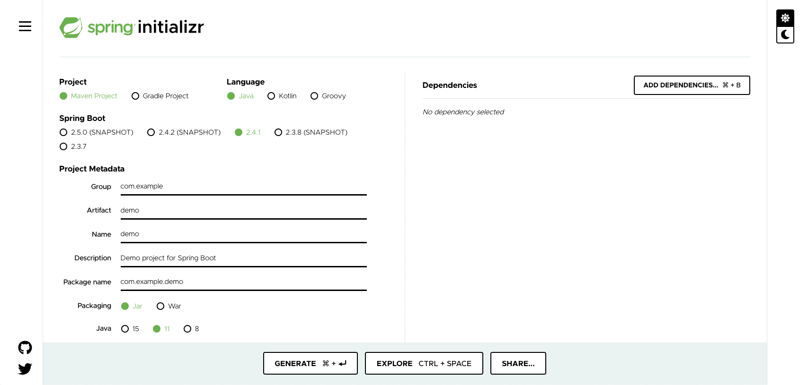

The first thing we need to do is create a Spring Boot application. We are going to look at two different ways you can quickly create a new Spring Boot application from scratch.

The first method is to use the **spring initialzr** site at [start.spring.io](https://start.spring.io/).



The purpose of the web site is to allow you to enter in details about the Spring Boot application you want to create. This includes the name of the application, the tooling you want to use, and any dependencies. When you click on generate it will automatically start a download of application source code for a Spring Boot application satisfying those requirements. You can then unpack that on your local computer and start working.

We will not be using this method because if used it will download the resulting application to your local computer, rather than this workshop environment. So great for when you do want to get started on your own machine, but not so here.

Although we can't use the web interface for start.spring.io to create the application for this workshop, the web site does provide an alternate way of creating an application through a REST API service. The REST API can be used directly, or via other front end interfaces.

For our second method we will use `curl` to make a request against the REST API service, download the application, and then unpack it. Run the command:

```execute
rm -rf demo && mkdir -p demo/shop && (cd demo/shop; curl https://start.spring.io/starter.tgz -d groupId=com.example.demo -d artifactId=shop -d name=shop -d description=Getting%20started%20with%20Spring%20Cloud%20-%20Shop -d packageName=com.example.demo.shop -d dependencies=web,actuator,cloud-contract-verifier,cloud-starter-sleuth -d javaVersion=11 | tar -xzvf -)
```

You can see the result by running:

```execute
tree demo/shop
```

To verify that the application code has been generated successfully, open up the main Java source code file for the application.

```editor:open-file
file: ~/demo/shop/src/main/java/com/example/demo/shop/ShopApplication.java
```

Next, check if you can build the application.

```execute
./mvnw clean verify
```

You should see the following output.

```
[INFO] ------------------------------------------------------------------------
[INFO] BUILD SUCCESS
[INFO] ------------------------------------------------------------------------
```